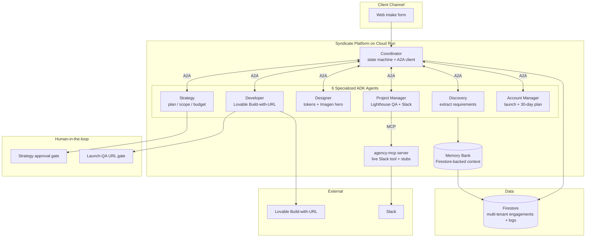

# Atlas

**The operations layer for the AI-native agency.**
Rubicx's Syndicate runs an entire client engagement — discovery, strategy, design, build, QA, post-launch — across 6 specialized [ADK](https://google.github.io/adk-docs/) agents that hand off work to each other over the [A2A protocol](https://a2a-protocol.org) and reach external tools through a custom [MCP](https://modelcontextprotocol.io) server. The Developer agent calls [Lovable's Build-with-URL API](https://docs.lovable.dev/integrations/build-with-url); Atlas owns the orchestration, client comms, and operations layer that Lovable doesn't.

> *"Lovable makes founders into developers. Atlas makes founders into agencies."*

Submission for the [Google for Startups AI Agents Challenge 2026](https://devpost.team/google-cloud-for-startups/hackathons/3197), **Track 1 (Build)** — a net-new multi-agent system built on ADK, A2A, and a custom MCP server, deployed on Cloud Run.

---

## Table of contents

1. [Architecture](#architecture)
2. [Quick start](#quick-start)
3. [Repo layout](#repo-layout)
4. [Agents](#agents)
5. [Stack](#stack)
6. [Build plan](#build-plan)
7. [License](#license)

---

## Architecture



Full architecture diagram (for the Devpost submission) → [docs/ARCHITECTURE.md](docs/ARCHITECTURE.md)

---

## Quick start

```bash
# 1. Clone and bootstrap (creates venv, installs deps, sets up Firebase emulator)
git clone https://github.com/USER/atlas.git
cd atlas
./scripts/bootstrap.sh

# 2. Configure (creates .env from .env.example — fill in your keys)
cp .env.example .env
# Edit .env with: GOOGLE_CLOUD_PROJECT, CLERK_PUBLISHABLE_KEY, LOVABLE_API_TOKEN, etc.

# 3. Run locally
make dev        # Starts dashboard on :3000 + agents on :8080 + Firestore emulator

# 4. Deploy to Cloud Run
make deploy     # Provisions infra via Terraform, deploys agents + dashboard
```

A successful local boot ends with a "Hello from Rubicx's Syndicate Coordinator" greeting and an empty engagements table at http://localhost:3000.

---

## Repo layout

```
atlas/
├── agents/                     Python — ADK agents
│   ├── coordinator/            Coordinator (state machine; routes between sub-agents via A2A)
│   ├── discovery/              Requirements extraction from a client brief
│   ├── strategy/               Positioning, plan, budget
│   ├── designer/               Design tokens + Imagen hero imagery
│   ├── developer/              Thin wrapper around Lovable Build-with-URL
│   ├── pm/                     Project Manager (Lighthouse QA + Slack update via MCP)
│   ├── account/                Account Manager (launch email + 30-day plan)
│   └── shared/                 Memory Bank wrappers, A2A helpers + Agent Cards, common types
├── apps/dashboard/             Next.js operator dashboard (TypeScript + Tailwind + shadcn/ui)
│   ├── app/                    App Router
│   ├── components/             shadcn/ui + custom
│   └── lib/                    Firestore client, Clerk hooks, A2A status fetcher
├── mcp/                        Custom MCP server (agency-mcp) exposing Shopify/Linear/Slack tools
├── infra/                      Terraform + Cloud Build + Firestore rules
├── docs/                       Architecture, build plan, Medium draft
└── scripts/                    bootstrap.sh, seed-client.py, eval-harness.py
```

---

## Agents

Each agent is a separate ADK module under `agents/`, deployed as its own Cloud Run service. They communicate over the A2A protocol — each serves an Agent Card at `/.well-known/agent-card.json` and a task endpoint at `/a2a/invoke` — with no shared in-memory state. The Coordinator is a deterministic state machine (no LLM); it dispatches to the LLM-backed sub-agents.

| Agent | Role | Model | What it does |
|---|---|---|---|
| **Coordinator** | Drives the per-engagement state machine; dispatches to sub-agents via A2A | — (orchestration only) | Sequences the pipeline, persists phase + logs to Firestore, runs the two human gates |
| **Discovery** | Extracts structured requirements from the client brief | `gemini-2.5-pro` | Turns a raw brief into goals, audience, constraints (voice intake is future work) |
| **Strategy** | Generates positioning, IA, plan, budget, timeline | `gemini-2.5-pro` | Produces the plan shown at the approval gate |
| **Designer** | Brand tokens + hero imagery | `gemini-2.5-flash` + `imagen-3.0-generate-001` | Generates design tokens/visual direction and a hero image |
| **Developer** | Launches the build via Lovable Build-with-URL | — (prompt assembly) | Assembles a Lovable prompt and initiates the build |
| **Project Manager** | Launch QA + client comms | `gemini-2.5-flash` | Runs Lighthouse on the live site, drafts the client update, posts it to Slack **via the agency-mcp server** |
| **Account Manager** | Post-launch handoff | `gemini-2.5-flash` | Drafts the launch email and a 30-day account plan |

ADK / protocol patterns used:
- **Sequential pipeline** — Discovery → Strategy → Designer → Developer → PM → Account, driven by the Coordinator state machine.
- **A2A handoffs** — every hop is an A2A task call; every agent publishes a spec-compliant Agent Card.
- **MCP tool use** — PM calls a custom MCP server (`agency-mcp`) over stdio to post the client update to Slack.
- **Human-in-the-loop** — two explicit gates: strategy approval, and a launch-QA gate where the operator pastes the published Lovable URL before PM runs real Lighthouse QA.

---

## Stack

| Layer | Technology |
|---|---|
| Orchestration | Google ADK · A2A protocol (Agent Cards + task endpoints) · custom MCP server |
| Reasoning | Gemini 2.5 Pro · Gemini 2.5 Flash · Imagen 3 (hero imagery) |
| Compute | Cloud Run (per-agent service) |
| Memory | Memory Bank (Firestore-backed per-engagement context) |
| Data | Firestore (multi-tenant engagements + logs) |
| Observability | Cloud Trace (OpenTelemetry spans per agent) |
| External | Lovable (Build-with-URL) · Slack (live, via agency-mcp) |
| Frontend | Next.js 15 (App Router) · TypeScript · Tailwind · shadcn/ui · Clerk (auth) |

### Future work (not in this submission)

Designed for but intentionally **not** built for the hackathon, and cut from the demo rather than faked:

- **Gemini Live voice intake** — Discovery's `run_voice_intake` is a stub (`NotImplementedError`); intake is via the web form/transcript today.
- **Governance layer** — Agent Identity, Agent Gateway, Model Armor, threat detection.
- **Wider MCP tools** — Shopify, Stripe, Linear, Figma tools exist as stubs; only Slack is live.
- **Analytics / evals** — Spanner cross-tenant analytics, BigQuery eval scores, an eval harness.
- **GKE Agent Sandbox** for codegen isolation.

---

## Build plan

Detailed plan with weekly milestones → [docs/BUILD_PLAN.md](docs/BUILD_PLAN.md)

| Week | Focus | Exit criterion |
|---|---|---|
| Pre-W1 (May 9–11) | ADK bootcamp · domain registered · 3 pilot clients confirmed | Toy 2-agent ADK app running locally |
| W1 (May 12–17) | Foundation + Discovery/Strategy/Developer agents · first real client live | One real Lovable-built site shipped through the Syndicate |
| W2 (May 18–24) | All 6 agents wired · Memory Bank · A2A across the graph · dashboard UI · publish Medium post | 3+ engagements in flight · dashboard at a real URL |
| W3 (May 25–31) | Production hardening: Simulation · Observability · Identity · Gateway · Model Armor · evals | Production-grade traces + sim report + governance config |
| W4 (Jun 1–5) | Lovable launch gate · genuine MCP-to-Slack · A2A Agent Cards · honesty pass · demo + writeup | **Submit by Thu Jun 5, 5PM PT** |

---

## License

Apache License 2.0 — see [LICENSE](LICENSE).
