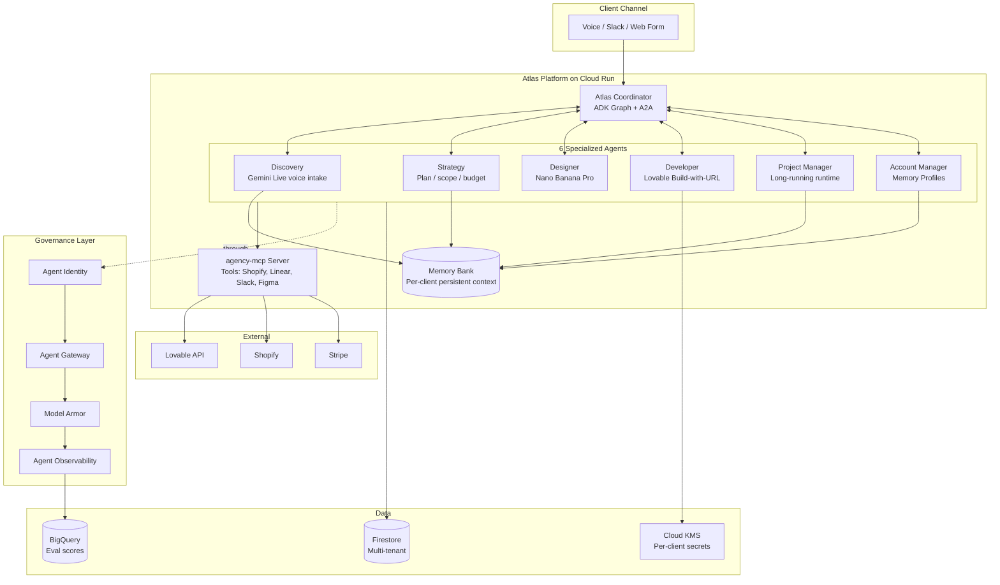

# Atlas

**The operations layer for the AI-native agency.**
Atlas runs the entire client engagement — discovery, strategy, design, build, project management, post-launch — across 6 specialized agents orchestrated on Google's Gemini Enterprise Agent Platform. The Developer agent calls [Lovable's Build-with-URL API](https://docs.lovable.dev/integrations/build-with-url); Atlas focuses on the orchestration, client comms, and operations layer that Lovable doesn't.

> *"Lovable makes founders into developers. Atlas makes founders into agencies."*

Submission for the [Google for Startups AI Agents Challenge 2026](https://devpost.team/google-cloud-for-startups/hackathons/3197), Track 2 (Optimize for Production).

---

## Table of contents

1. [Architecture](#architecture)
2. [Quick start](#quick-start)
3. [Repo layout](#repo-layout)
4. [Agents](#agents)
5. [Stack](#stack)
6. [Build plan](#build-plan)
7. [License](#license)

---

## Architecture



Full architecture diagram (for the Devpost submission) → [docs/ARCHITECTURE.md](docs/ARCHITECTURE.md)

---

## Quick start

```bash
# 1. Clone and bootstrap (creates venv, installs deps, sets up Firebase emulator)
git clone https://github.com/USER/atlas.git
cd atlas
./scripts/bootstrap.sh

# 2. Configure (creates .env from .env.example — fill in your keys)
cp .env.example .env
# Edit .env with: GOOGLE_CLOUD_PROJECT, CLERK_PUBLISHABLE_KEY, LOVABLE_API_TOKEN, etc.

# 3. Run locally
make dev        # Starts dashboard on :3000 + agents on :8080 + Firestore emulator

# 4. Deploy to Cloud Run
make deploy     # Provisions infra via Terraform, deploys agents + dashboard
```

A successful local boot ends with a "Hello from Atlas Coordinator" greeting and an empty engagements table at http://localhost:3000.

---

## Repo layout

```
atlas/
├── agents/                     Python — ADK agents
│   ├── coordinator/            Atlas Coordinator (routes between sub-agents via A2A)
│   ├── discovery/              Voice intake via Gemini Live
│   ├── strategy/               Positioning, plan, budget
│   ├── designer/               Nano Banana Pro for imagery + design tokens
│   ├── developer/              Thin wrapper around Lovable Build-with-URL
│   ├── pm/                     Project Manager (long-running, daily client digests)
│   ├── account/                Account Manager (post-launch, upsell, churn)
│   └── shared/                 Memory Bank wrappers, A2A helpers, common types
├── apps/dashboard/             Next.js operator dashboard (TypeScript + Tailwind + shadcn/ui)
│   ├── app/                    App Router
│   ├── components/             shadcn/ui + custom
│   └── lib/                    Firestore client, Clerk hooks, A2A status fetcher
├── mcp/                        Custom MCP server (agency-mcp) exposing Shopify/Linear/Slack tools
├── infra/                      Terraform + Cloud Build + Firestore rules
├── docs/                       Architecture, build plan, Medium draft
└── scripts/                    bootstrap.sh, seed-client.py, eval-harness.py
```

---

## Agents

Each agent is a separate ADK module under `agents/`, deployed as its own Cloud Run service. They communicate exclusively via the A2A protocol — no shared in-memory state.

| Agent | Role | Model | Key tools |
|---|---|---|---|
| **Coordinator** | Routes work through the graph; maintains per-engagement state machine | Gemini 3 Pro | `route_to`, `wait_for`, `human_approval` |
| **Discovery** | Conducts a voice intake call, transcribes, extracts requirements | Gemini Live + Gemini 3 | `start_call`, `transcribe`, `extract_requirements` |
| **Strategy** | Generates positioning, IA, plan, budget, timeline | Gemini 3 Pro | `analyze_competitors`, `draft_plan`, `score_feasibility` |
| **Designer** | Hero imagery, brand tokens, design system | Nano Banana Pro + Gemini 3 | `generate_imagery`, `extract_tokens`, `draft_components` |
| **Developer** | Triggers Lovable build via Build-with-URL, deploys, wires Stripe | Gemini 3 + Code Tools | `lovable_build`, `deploy_to_lovable_cloud`, `connect_stripe` |
| **Project Manager** | Daily client digests, blocker triage, timeline updates | Gemini 3 Flash | `post_to_slack`, `update_linear`, `flag_blocker` |
| **Account Manager** | Post-launch monitoring, QBRs, upsell radar | Gemini 3 Flash | `run_lighthouse`, `draft_qbr`, `score_upsell` |

ADK patterns used (named explicitly because judges grade for fluency):
- **Sequential Agent** — Discovery → Strategy → Designer → Developer
- **Loop Agent** — Developer iterates on Lovable output until QA passes
- **Parallel Agent** — Designer + Strategy run concurrently after Discovery
- **Review/Critique** — PM agent reviews Developer output before client comms
- **Human-in-the-Loop** — Account manager pauses for owner approval on upsell

---

## Stack

| Layer | Technology |
|---|---|
| Orchestration | Gemini Enterprise Agent Platform · ADK · A2A Protocol · Agent Garden templates |
| Reasoning | Gemini 3 Pro · Gemini 3 Flash · Nano Banana Pro · Gemini Live |
| Compute | Cloud Run (per-agent service) · GKE Agent Sandbox (codegen isolation) |
| Memory | Memory Bank · Memory Profiles (per-client) |
| Data | Firestore (multi-tenant) · Spanner (cross-tenant analytics) · BigQuery (eval scores) |
| Governance | Agent Identity · Agent Gateway · Model Armor · Agent Threat Detection · Cloud KMS |
| Observability | Agent Observability · Cloud Trace · BigQuery for evals |
| External | Lovable (Build-with-URL) · Shopify Storefront API · Stripe · Linear · Slack |
| Frontend | Next.js 15 (App Router) · TypeScript · Tailwind · shadcn/ui · Clerk (auth) |

---

## Build plan

Detailed plan with weekly milestones → [docs/BUILD_PLAN.md](docs/BUILD_PLAN.md)

| Week | Focus | Exit criterion |
|---|---|---|
| Pre-W1 (May 9–11) | ADK bootcamp · domain registered · 3 pilot clients confirmed | Toy 2-agent ADK app running locally |
| W1 (May 12–17) | Foundation + Discovery/Strategy/Developer agents · first real client live | One real Lovable-built site shipped through Atlas |
| W2 (May 18–24) | All 6 agents wired · Memory Bank · A2A across the graph · dashboard UI · publish Medium post | 3+ engagements in flight · dashboard at a real URL |
| W3 (May 25–31) | Production hardening: Simulation · Observability · Identity · Gateway · Model Armor · evals | Production-grade traces + sim report + governance config |
| W4 (Jun 1–3) | Architecture diagram · 3-min demo video · business case writeup · submit | **Submit Wed Jun 3 evening** (48h buffer) |

---

## License

Apache License 2.0 — see [LICENSE](LICENSE).
