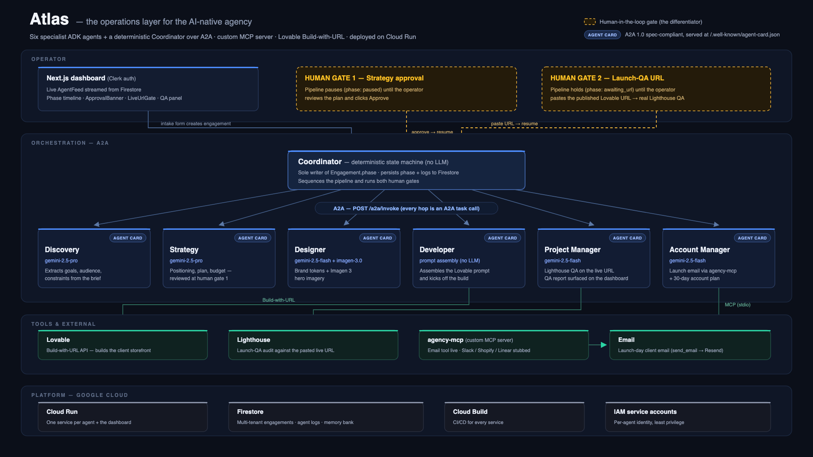

# Atlas — Devpost submission (Track 1: Build)

**Tagline:** A digital agency that runs itself — six ADK agents that take a client from an
intake form to a live storefront, coordinating over A2A and acting through a custom MCP server.

---

## Inspiration

I run a small digital agency. The work that fills the week isn't the creative part — it's the
relay race between roles: discovery into strategy, strategy into design, design into build, build
into QA, QA into a client update. Every handoff is a place where context gets dropped and time
gets burned. Atlas is that relay race rebuilt as a team of cooperating AI agents, with humans kept
in exactly the two places where judgment actually matters.

## What it does

Atlas turns a one-paragraph client brief into a launched storefront:

1. **Intake** — an operator submits a brief (business name, goal, budget) from the dashboard.
2. **Discovery** researches the market and customer.
3. **Strategy** writes the engagement spec — then Atlas **pauses for human approval**.
4. **Designer** generates the brand direction (Imagen 3) once strategy is approved.
5. **Developer** kicks off the storefront build in Lovable.
6. **Launch QA gate** — Atlas pauses again: a human confirms the real Lovable site is live and
   pastes its published URL. That URL drives the rest of the pipeline against the actual site.
7. **PM** runs a Lighthouse check on the live site and surfaces the QA report on the **dashboard**.
8. **Account** closes out the engagement and moves it to Operate.

The whole run streams live in the dashboard: a phase timeline plus an agent activity feed.

## How we built it

- **Agents (ADK):** 6 specialized agents + a Coordinator, each a FastAPI service. Models:
  `gemini-2.5-pro` for reasoning-heavy roles, `gemini-2.5-flash` for lighter ones, `imagen-3.0`
  for the Designer's brand imagery.
- **A2A (Agent2Agent):** every agent serves a spec-compliant Agent Card at
  `/.well-known/agent-card.json` declaring its name, skills, and capabilities. The Coordinator
  invokes each agent over an `/a2a/invoke` endpoint.
- **MCP (Model Context Protocol):** a custom `agency-mcp` server gives agents external tools. The
  live tool is `send_email` — the Account agent dispatches the launch-day email through it via
  ADK's `McpToolset` over stdio (delivery via Resend); Slack, Shopify, and Linear tools ship as
  stubs for extensibility.
- **Human-in-the-loop:** two deliberate gates — strategy approval and launch QA — implemented as
  distinct engagement phases (`paused` and `awaiting_url`) that the dashboard renders as action
  banners.
- **Frontend:** Next.js dashboard (engagements list + per-engagement detail with phase timeline and
  live agent feed).
- **Persistence:** Firestore for engagements, logs, and a cross-engagement memory bank, with
  tenant-scoped security rules.
- **Infra:** all services deployed on Cloud Run; builds via Cloud Build.

## Architecture

*Operator layer → Coordinator → six A2A agents → tools, on Cloud Run + Firestore. The amber dashed boxes are the two human-in-the-loop gates. (On Devpost itself this PNG is uploaded and inlined in the description.)*

## Challenges we ran into

- **Knowing when an external build is "done."** Lovable doesn't give us a programmatic
  build-complete signal. Rather than fake it, we made the handoff an explicit launch-QA gate: a
  human confirms the live site and pastes the URL, which then drives PM's real Lighthouse check
  against the deployed store. Honest, and it makes the QA step a feature, not a hack.
- **ADK structured output + tools.** ADK constrains using tools alongside a strict `output_schema`.
  The Account agent needs both: a structured `AccountReport` and the `send_email` MCP tool. We split
  it — the main agent keeps the schema, and a small free-form dispatch sub-agent (no schema) calls
  `send_email` exactly once via `McpToolset`; an `after_tool_callback` captures the tool result and
  merges the delivery status back into the report.
- **Packaging the MCP server into the Account image.** Rather than running `agency-mcp` as a
  separate network service, it runs over stdio inside the Account container — a real MCP
  client/server boundary for the email call without another deployment to keep healthy.

## What we learned

A2A and MCP are not the same primitive: A2A is how agents discover and call each other, MCP is how
a single agent reaches external tools. Atlas uses A2A for orchestration; MCP tools ship in the repo
for extensibility. The strongest demos are the honest ones — the human gates make Atlas more credible, not less.

## On ADK 2.0

ADK 2.0 (June 2026) shipped a graph-based Workflow Runtime with first-class human-in-the-loop nodes
and a Task API for structured delegation. Atlas's hand-built Coordinator state machine and its two
human gates map directly onto those primitives — the architecture was converging on the same shape.
We pinned the 1.x build as a deliberate stability choice this close to the deadline, and the
migration path (state machine → workflow graph, gates → HITL nodes) is clean.

## What's next

Voice intake (Gemini Live), an observability/traces dashboard, a multi-client load simulation, and
enterprise governance (identity, gateway, model armor). Deliberately out of scope for this build so
the submission only claims what actually runs. Nearer-term: the ADK 2.0 migration described above.

## Testing access

- **Live dashboard:** `<DASHBOARD_URL>`
- **Demo login (Clerk):** `<DEMO_EMAIL>` / `<DEMO_PASSWORD>`

What to try (5 minutes):

1. Sign in and create an engagement at `<DASHBOARD_URL>/engagements/new` — any business name, goal,
   and budget will do.
2. On the engagement detail page, watch the phase timeline advance while the agent feed streams
   Discovery and Strategy events live.
3. When the approval banner appears, read the strategy and click **Approve**.
4. When the phase reaches **Awaiting URL**, paste the provided Lovable storefront URL
   (`<LOVABLE_STOREFRONT_URL>`) into the launch-QA gate and submit.
5. Watch PM run the Lighthouse check against that live site, then view the QA report and the launch
   pack on the dashboard.

## Built with

ADK · Gemini 2.5 Pro / Flash · Imagen 3 · A2A · Model Context Protocol · FastAPI · Next.js ·
Firestore · Cloud Run · Cloud Build · Lovable · MCP email tooling (Resend)
